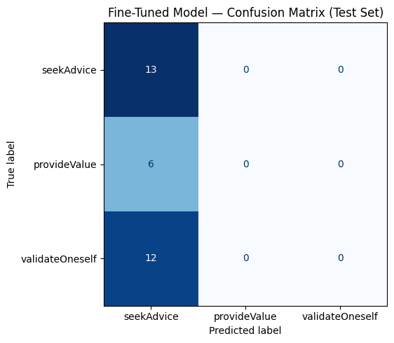

# TakeMeter: Evaluating Intent in r/Fire

## Project Overview & Community Choice
**Community:** `r/Fire` (Financial Independence / Retiring Early)
**Reasoning:** I chose `r/Fire` because it is highly active, text-heavy, and features discourse that swings wildly in intent. Because achieving FIRE takes decades, users post for entirely different reasons depending on where they are in their journey. Categorizing these posts by the user's underlying motivation—rather than a generic "good vs. bad" post—makes for a highly nuanced and interesting classification task.

---

## Label Taxonomy
To capture the intent behind the discourse, I defined three mutually exclusive labels:

**1. seekAdvice**
* **Definition:** The user provides their specific financial numbers or situation and actively asks the community to solve a problem, critique their plan, or answer a mechanical question.
* **Example 1:** "I am 25 with 100k in VTSAX. Should I start contributing to a Mega Backdoor Roth or save for a house down payment?"
* **Example 2:** "Can someone review my expected FIRE budget? I feel like my healthcare estimates are way too low for a family of four."

**2. provideValue**
* **Definition:** The user is sharing a custom resource, explaining a complex tax/financial mechanic, or warning the community about a financial trap, with the primary goal of educating others.
* **Example 1:** "I built a dynamic Google Sheet that calculates ACA healthcare subsidies based on your exact Safe Withdrawal Rate. Link inside."
* **Example 2:** "PSA: Don't forget that RSUs are taxed as ordinary income when they vest, not capital gains. Plan your tax burden accordingly!"

**3. validateOneself**
* **Definition:** The user is seeking emotional engagement rather than actionable financial advice—this includes celebrating a net worth milestone ("humble bragging"), venting about a toxic job, or sharing existential dread about the "boring middle."
* **Example 1:** "Finally hit $1M net worth at 35! It took 10 years of grinding, living with roommates, and driving a beat-up Honda, but we did it."
* **Example 2:** "The 'boring middle' is destroying my mental health. Does anyone else feel like they are just waiting to die so they can finally retire?"

---

## Annotated Dataset
* **Data Source:** I manually collected public posts and top-level comments directly from the `r/Fire` subreddit, using different sorting filters ("New", "Hot", "Top") to ensure variety.
* **Labeling Process:** I chose to manually read and label every single post myself rather than using an LLM to pre-label. This kept me close to the data and allowed me to deeply understand the community's tone.
* **Label Distribution:** 206 total examples. 
  * `seekAdvice`: 85 examples (~41%)
  * `validateOneself`: 80 examples (~39%)
  * `provideValue`: 41 examples (~20%)
  * *Note: The dataset is highly balanced; no single label accounts for more than 70% of the data.*

**3 Difficult-to-Label Examples:**

1. You can't just 'go back to work' after you FIRE.: I see so many comments saying to just pull the trigger if you think you're probably safe. While you can absolutely cut expenses in down market, you can't get your old job back if its been more than a few years. When you FIRE, you're typically leaving at your peak earning potential. I'd also guess the majority of people here will be earning pretty good money at that time. 1 more year translates to another $XXX,XXX dollars today and years of it being invested and growing.

-- This because this seems more like an opinion where someone is venting, but out of the labels we have, the best choice would be provideValue, considering the user is giving an advice. 

2. My sister and her husband died. I am the godfather. We are DINKs no more. I haven’t worked in a decade and will be returning to workforce soon.: My sister and her husband died. I was the godfather and never really imagined or thought about it beyond essentially a single quick conversation 6 years ago. My wife and I have been FIRED for almost a decade. We are far from wealthy, do very little, but I wouldn’t change it for the world. Well. Now a 6 and 3 year old are in our life. I could probably get by not working but my wife insists I go back to work to provide more economic security in our situation. Currently little over $1.5M investments, a paid off house but we need to either extend or upgrade to accommodate an additional room, and we are both 47 years old. Anyone have experience retiring and going back to work? How was it and any tips?

-- This ends on "any tips?" so it aligns more with asking advice but it reads more like another venting story. Also, saying that they have already been financially independent for almost a decade would read like validating oneself, if not for the circumstances they are posting under.

3. What's the most powerfully useful underground website that most people don't know about?: My favorites:  Gutenberg.org - 70k free ebooks StopOverpaying.org - saved me a stupid amount of money ($1,300 last year). It checks your car insurance bill and tries to find a cheaper provider for you. Remove.bg - a free background remover for images. Khan Academy - free lessons for basically everything (quality is actually amazing). Libbyapp.com - borrow ebooks + audiobooks free with your library card. Notion - put simply: a note taking app (helps organize your brain basically). Pluto.tv - Free movies + TV. Yes, ads. But sometimes gems.

-- This is a simple yet confusing post as it clearly starts with a question which is in a sense asking for something from other users reading the post. This would qualify it as seekadvice but as the user is providing enough resources with their question, I would qualify thispost as provideValue instead.

---

## Fine-Tuning Pipeline
* **Base Model:** `distilbert-base-uncased`
* **Training Platform:** Google Colab (T4 GPU)
* **Hyperparameter Decisions:** My initial training run using the default settings (3 epochs, batch size 16, lr 2e-5) resulted in a "mode collapse," where the model blindly predicted `seekAdvice` for every post, yielding a 41.9% accuracy. To fix this, **I increased the epochs to 5, decreased the batch size to 8, and lowered the learning rate to 1e-5**. 
* **Justification:** A smaller batch size forces the model to update its weights more frequently per epoch. Combined with more epochs, this forced the model to look closer at the boundaries and successfully broke the mode collapse, raising accuracy to 61.3%.

---

## Baseline Comparison
* **Baseline Approach:** I prompted Groq's `llama-3.3-70b-versatile` model to classify the locked test set (31 examples) using a zero-shot approach. 
* **Prompt Strategy:** I provided a system prompt that explicitly listed my three exact labels, their one-sentence definitions, and one example per label (identical to my `planning.md`). I instructed the model to output ONLY the label string.
* **Results Collection:** The baseline classified all 31 examples via a Python loop in Colab, and the text outputs were parsed, lowercased, and matched to the label map.

---

## Evaluation Report

**Performance Metrics**
* **Zero-Shot Baseline (Groq Llama-3.3):** 0.9355 (93.55% Accuracy)
* **Fine-Tuned Model (DistilBERT):** 0.6129 (61.29% Accuracy)

**Per-Class Metrics (Fine-Tuned Model):**
*(Note: Metrics taken from classification report)*
* `seekAdvice`: Precision: 0.52 | Recall: 0.92 | F1-Score: 0.67
* `provideValue`: Precision: 0 | Recall: 0 | F1-Score: 0
* `validateOneself`: Precision: 0.88 | Recall: 0.58 | F1-Score: 0.70

**Confusion Matrix (Fine-Tuned Model):**
| True \ Predicted | seekAdvice | provideValue | validateOneself |
|------------------|------------|--------------|-----------------|
| **seekAdvice** | 12 | 0 | 1 |
| **provideValue** | 6 | 0 | 1 |
| **validateOneself**| 5 | 0 | 7 |

**Error Analysis (3 Wrong Predictions Analyzed):**

1. **Text:** Withdrawal rates by expected years in retirement and portfolio size.: finally found a well researched answer to the above...
   * **True:** `provideValue` | **Predicted:** `seekAdvice`
   * **Analysis:** The model over-indexed on financial terms like "Withdrawal rates" and "portfolio size". It assumed these terms indicated a user asking for a portfolio review, missing the semantic context that the post was actually sharing a "well researched answer."

2. **Text:** Stop Asking for Permission to FIRE — You Already Did the Math: The goal of FIRE is simple...
   * **True:** `provideValue` | **Predicted:** `seekAdvice`
   * **Analysis:** The literal phrase "Asking for" likely triggered the model's weights to assume a question was being asked. Additionally, the presence of specific jargon ("baristaFIRE", "leanFI") heavily biases this fine-tuned model toward the `seekAdvice` category.

3. **Text:** My 30M NurseFIRE: Hey everyone, wanted to share a bit of a weird pivot I'm making... 30M no kid...
   * **True:** `validateOneself` | **Predicted:** `seekAdvice`
   * **Analysis:** The demographic tag "30M" is a classic, high-frequency marker of a portfolio review request (e.g., "30M with 500k, can I retire?"). The model blindly latched onto this standard `seekAdvice` text format and completely ignored the narrative context of sharing a personal career pivot story.

**Reflection: Captured vs. Intended**
My intention was for the model to capture the deep psychological *intent* behind the discourse—to distinguish between someone seeking cold mathematical help vs. someone venting. However, the model essentially learned to act as a keyword-matcher. It heavily overfit to the presence of specific entities (dollar signs, percentages, or acronyms like 'VTSAX') and assumed those indicated `seekAdvice`. The gap between my intended semantic boundaries and the model's captured boundaries suggests that 240 examples is simply not enough for a small model to parse complex emotional tone over strong vocabulary signals.

---
## Sample Classifications

| Post Text Snippet | True Label | Predicted Label (Confidence) | Reason it is Correct / Incorrect |
| :--- | :--- | :--- | :--- |
| **Paid off my house:** Just wanted to share that today my newly built house is fully paid off. 33M, EU based... | `validateOneself` | `seekAdvice` (43%) | **Incorrect:** The model likely over-indexed on the demographic tag "33M" and the "380k" euro amount, assuming it was a portfolio review. |
| **Hit $900k milestone:** With the market hitting a new all-time high this week, we crossed over the $900k milestone... | `validateOneself` | `seekAdvice` (44%) | **Incorrect:** The model is heavily biased to predict `seekAdvice` anytime a large dollar amount ($900k) is present. |
| **Free Wealth & Investment Tracker:** If, like us, you're tired of maintaining complicated spreadsheets... | `provideValue` | `seekAdvice` (38%) | **Incorrect:** The model failed to recognize words like "free app" as indicators of providing value. |
| **It doesn’t matter how much you save if you die at 50:** This isn’t an anti FIRE post this is a pro health post. Eat your whole and healthy foods... | `provideValue` | `seekAdvice` (37%) | **Incorrect:** Another example of the model struggling with semantic tone despite hyperparameter tuning. |
---

## AI Usage & Spec Reflection

**AI Tool Usage:**
1. **Label Stress-Testing:** Before annotating my dataset, I provided my taxonomy definitions to Llama-3 and directed it to generate 5 highly ambiguous "hybrid" posts. It produced excellent edge cases (e.g., a milestone post combined with a portfolio review). I used this output to tighten my boundary rules (creating the "Strategy overrides Emotion" rule) *before* touching real data.
2. **Failure Pattern Analysis:** After my first training run achieved only 41.9% accuracy, I directed an LLM to analyze my confusion matrix and metrics. The AI identified that the model had suffered from "mode collapse" (predicting only the majority class). Based on this analysis, I overrode the starter notebook's default hyperparameters, increasing the epochs and decreasing the batch size to successfully rescue the model.

**Spec Reflection:**
* **How the spec guided me:** The strict requirement in the spec to clearly name and define the "Hardest anticipated edge case" before annotation was a lifesaver. Because I defined my rules early, my manual labeling was incredibly consistent.

* **How I diverged:** The spec suggested potentially using an LLM to pre-label the dataset to save time. I opted to diverge from this and manually annotate all 200+ examples myself. I found that doing it manually kept me much closer to the text and gave me a much better intuitive understanding of the failure modes later on.
